# Messenger
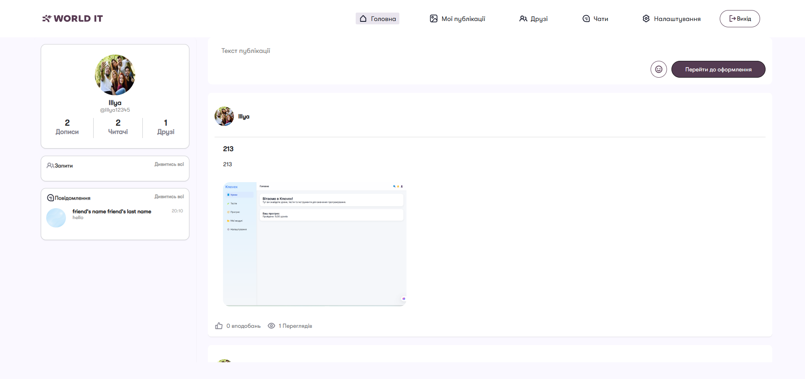

## Block explaining the purpose of the project and who it will be useful to
- This project was created as a modern web messenger for exchanging messages, creating posts, albums and group chats.
- The goal is to provide users with a convenient tool for communicating, exchanging ideas, photos and organizing communities.
- The project will be useful to students, teachers, teams, friends, as well as anyone looking for a simple way to communicate and share content in closed or open groups.

---


---

## Participants

- **Illya Epik** — [GitHub](https://github.com/IllyaEpik/messenger) 
    Project team leader: organizing teamwork, developing architecture, integrating all components, quality control, final testing.

- **Renat Belei** — [GitHub](https://github.com/Renat19Belei/messenger) 
    Responsible for layout: adapting the design to the application, styling the pages, ensuring usability, implementing interactive elements on the frontend, working with the design.

- **Mark Popovich** — [GitHub](https://github.com/markpopovich9/messenger) 
    Backend developer: implementing server logic, configuring Django, working with the database, implementing WebSocket for messaging, ensuring security and stability of the service.

---

## Navigation
- [Startup Instructions](#startup-instructions)
  - [Instructions for running on local host (via terminal)](#instructions-for-running-on-local-host-via-terminal)
  - [Instructions for running on localhost (via PyCharm or VSCode)]
  - (#instructions-for-running-on-local-host-via-pycharm-or-vscode)
- [Project Structure](#project-structure)
  - [user_app](#structure-user_app)
  - [post_app](#structure-post_app)
  - [chat_app](#structure-chat_app)
  - [main_app](#structure-main_app)
  - [messenger_dir](#structure-messenger_dir)
- [Project features](#project features)
  - [Working with images](#Working-with-images)
  - [Working with web sockets](#Working-with-websockets)
  - [The principle of posts](#The-principle-of-posts)
  - [The principle of work of albums](#The principle of work of albums)
  - [The principle of operation of chats](#chat-work-principle)
  - [Working with AJAX](#working-with-ajax)
  - [How registration and authorization work](#how-registration-and-authorization-work)
  - [How the Friends App Works](#how-the-friends-app-works)
- [Conclusion](#conclusion)

---

## Instructions for running

[⇧ Return to navigation](#navigation)

### Instructions for running on localhost (via terminal)

1. Make sure you have Python installed (version 3.8+ recommended).
2. Download the project from Github (via the Code → Download ZIP button or via git clone).
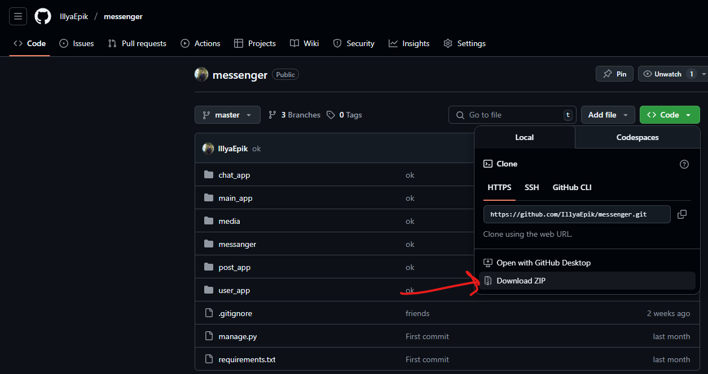
3. Unzip the project to the desired folder (if you downloaded the ZIP).
4. Open a terminal (cmd, PowerShell or Terminal).
5. Go to the project folder with the command:
   ```
   cd path_to_project_folder
   ```
6. (Recommended) Create and activate a virtual environment:
   - Windows:
     ```
     python -m venv venv
     venv\Scripts\activate
     ```
   - Mac/Linux:
     ```
     python3 -m venv venv
     source venv/bin/activate
     ```
7. Install dependencies:
   ```
   pip install -r requirements.txt
   ```
   (or `pip3 install -r requirements.txt` and Mac/Linux)
8. Perform database migrations:
   ```
   python manage.py migrate
   ```
9. Start the server:
   ```
   python manage.py runserver
   ```
10. Open a browser and go to the address [http://127.0.0.1:8000/](http://127.0.0.1:8000/)

---

### Instructions for running on localhost (via PyCharm or VSCode)

[⇧ Back to navigation](#navigation)

1. Open the project folder in PyCharm or VSCode.
2. Make sure you have Python installed (version 3.8+ recommended).
3. (Recommended) Create a virtual environment via the IDE or terminal.
4. Install dependencies:
   ```
   pip install -r requirements.txt
   ```
5. Perform database migrations:
   ```
   python manage.py migrate
   ```
6. Start the server via the IDE (Run/Debug) or with the command:
   ```
   python manage.py runserver
   ```
7.Open a browser and go to the address [http://127.0.0.1:8000/](http://127.0.0.1:8000/)

---

## structure project

[⇧ Повернутися до навігації](#навігація)

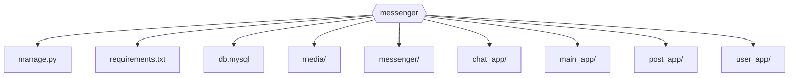

- [structure user_app](#structure-user_app)
- [structure post_app](#structure-post_app)
- [structure chat_app](#structure-chat_app)
- [structure main_app](#structure-main_app)
- [structure messenger_dir](#structure-messenger_dir)

---

### structure user_app
[⇧ Повернутися до навігації](#навігація)

> Describes the structure of a user management application: registration, authorization, profile, templates, statics.

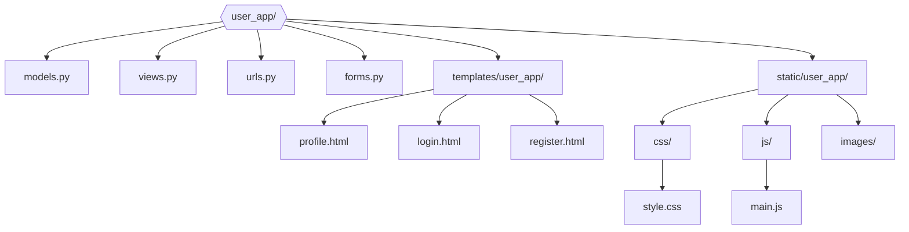

user_app — application for user management: registration, authorization.

---

### structure post_app
[⇧ Return to navigation](#navigation)

> Describes the structure of the application for working with posts: creating, viewing, editing, deleting posts.

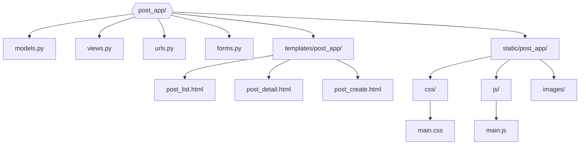

post_app — application for managing posts: creating, viewing, editing, deleting posts.

---

### structure chat_app
[⇧ Return to navigation](#navigation)

> Describes the structure of a chat application: group chats, private messages, templates, statics.

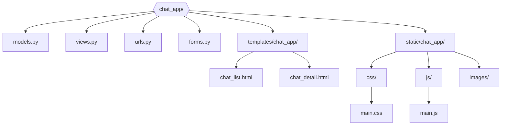

chat_app —chat management application: creating group chats, editing groups, as well as private messages between users.

---

### structure main_app
[⇧ Return to navigation](#navigation)

> Describes the structure of the main application: general pages, profile, data editing, avatar, password change.

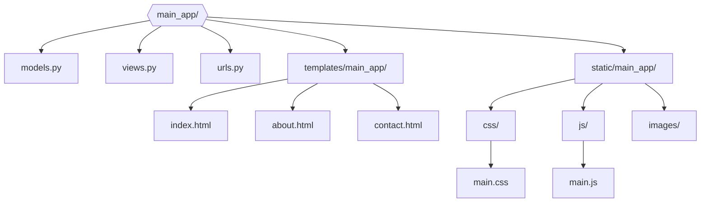

main_app — the main application, which contains common pages: home page, about us, contact information, user profile, edit data, avatar, change password, etc.

---

### structure messenger_dir
[⇧ Return to navigation](#navigation)

> Describes the structure of the basic configuration of a Django project: settings, routing, server startup.

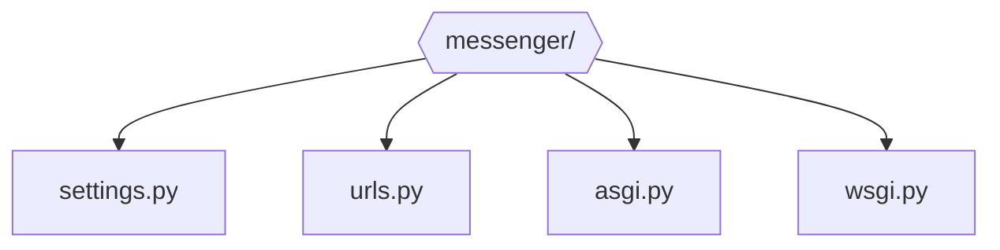

messenger_dir — basic Django project configuration: settings, routing, server startup.

---

## Project Features

[⇧ Return to navigation](#navigation)

### Working with images

Our messenger has full support for working with images: users can change their avatar, add photos to posts, and create albums. Images are uploaded via forms with a preview, and all files are stored in a special media directory. For the user's convenience, a thumbnail is displayed immediately after selecting a file. Updating an avatar or adding a photo to a post does not require a page reload — everything works via AJAX.

**Logic file:**
`user_app/static/user_app/personal.js`

**Gif demo:** 
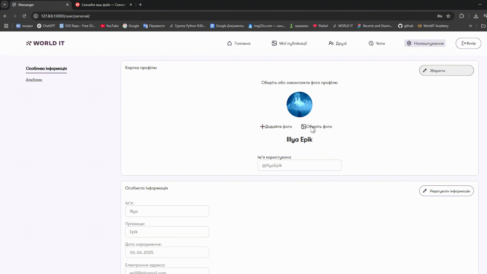

---

### Working with WebSockets

[⇧ Back to navigation](#navigation)

WebSocket is used to provide instant messaging in chats. Each chat (group or private) has its own channel, and all messages are transmitted in real time without reloading the page. When a user opens a chat, a WebSocket connection to the server is created on the client, and all new messages immediately appear in the chat window.

**Logic file:** 
`chat_app/consumers.py` 
`chat_app/static/chat_app/chat.js` 
**Gif demo:** 
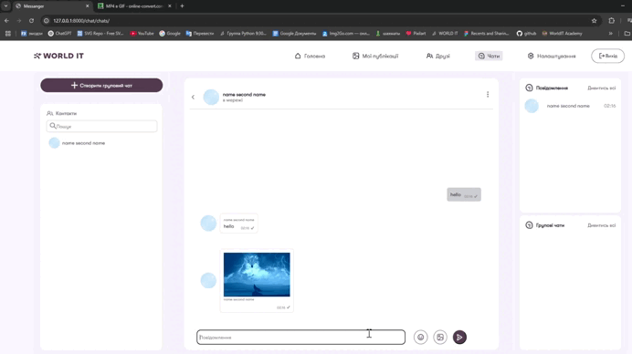
---

### How posts work

[⇧ Back to navigation](#navigation)

Users can create, edit, and delete posts, and add images and tags to them. All actions with posts are performed via AJAX, which provides fast interaction without reloading the page. Posts are stored in the database, and images are stored in the media directory. You can add multiple images to each post, and use standard or custom tags for easy navigation.

**Logic file:** 
`post_app/views.py`, `post_app/forms.py`
**Gif demo:** 
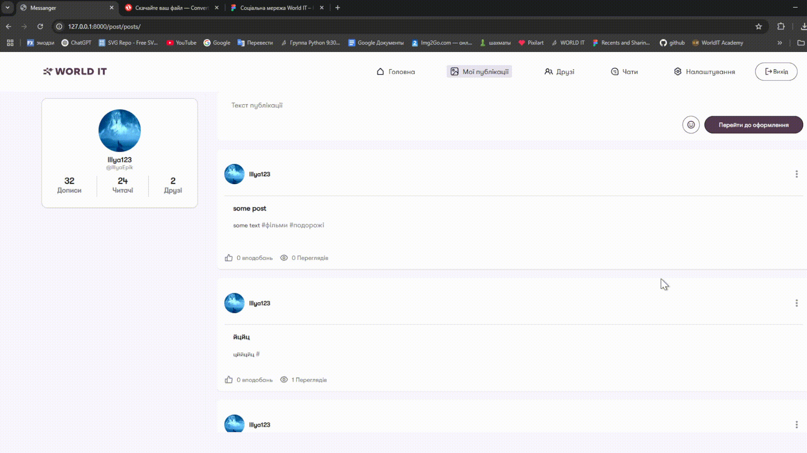

---

### How albums work

[⇧ Back to navigation](#navigation)

**Create an album:** 
The user can create a new album by specifying its name and description. After creating the album, photos can be added to it. All actions are performed through asynchronous requests, which allows you to see the result immediately without reloading the page.
```python
# user_app/views.py
form_type = request.POST.get("type")
if form_type == 'album':
    # Create new album
    theme=request.POST.get("themeSelect")
    tag=Tag.objects.filter(name=theme).first()
    if not tag:
        tag = Tag.objects.create(name=theme)
    album = Album.objects.create(
        name = request.POST.get("name"),
        topic= tag,
        author=profile
    )
    album.created_at = album.created_at.replace(year=int(request.POST.get("year")))
    album.save()
```
**Adding and viewing images:** 
You can add multiple images to each album. All photos are displayed in a convenient interface where you can view them in full size, delete or add new ones. Uploading images is done through forms with preview.
```python
# user_app/views.py
elif form_type == 'images':
# Adding images to an album
album = Album.objects.get(pk=int(request.POST.get("pk")))
img_list = []
for img in request.FILES.getlist('images'):
    album.images.add(Image.objects.create(file=img))
    album.save()
album.save()
```
**Logic file:** 
`user_app/views.py`, `user_app/static/user_app/albums.js` 
**Gif demo:** 
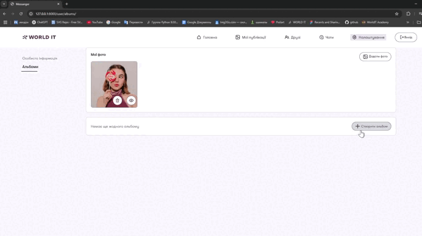
---

### How chats work

[⇧ Back to navigation](#navigation)

**Opening a chat:** 
The user can open both a personal and a group chat. When opening a chat, a WebSocket connection is established with the server, and all new messages arrive in real time. The chat interface is updated instantly for all participants.

**Sending messages:** 
Messages (text and images) are sent via WebSocket, which ensures their instant delivery to all chat participants. For group chats, adding/removing participants, changing the avatar and group name are implemented.

**Logic file:** 
`chat_app/views.py`, `chat_app/static/chat_app/chat.js` 
**Gif demo:** 


---

### Робота з AJAX

[⇧ Back to navigation](#navigation)

Most of the actions in the application (adding/editing posts, changing avatar, editing profile, adding friends) are performed asynchronously via AJAX. This allows you to update only the necessary parts of the page without reloading the entire page, which significantly improves the user experience.

**Logic file:** 
`user_app/static/user_app/personal.js` 
**Gif demo:** 
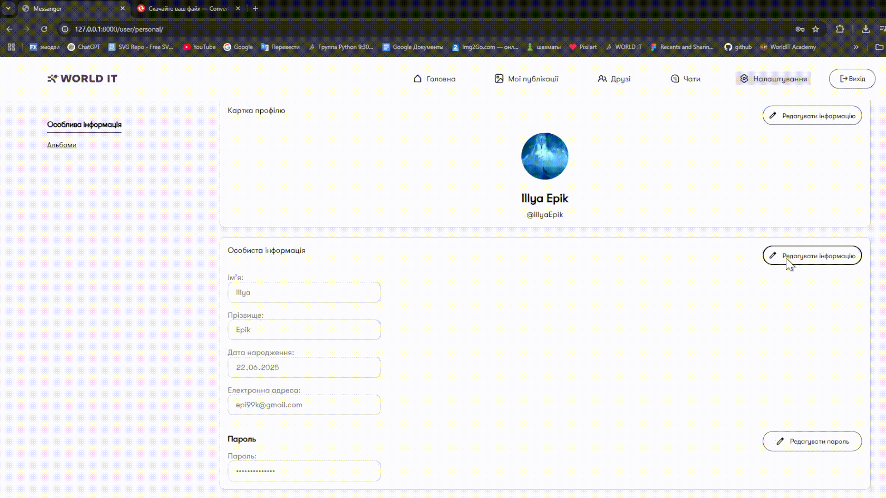

---

### How registration and authorization work

[⇧ Return to navigation](#navigation)

Registration and authorization are implemented through standard Django forms with additional checks. After registration, the user receives an email to confirm their email (if configured), and when logging in, they undergo data verification. CSRF protection is used for security, and all passwords are stored in hashed form.

**Logic file:** 
`user_app/views.py`
**Gif demo:** 
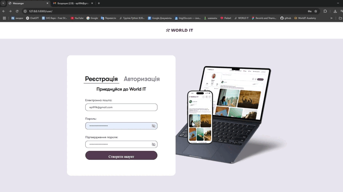

---

### How the Friends App Works

[⇧ Back to navigation](#navigation)

**Adding and confirming friends:** 
Users can send friend requests, confirm or reject them. All actions are performed asynchronously, which ensures a fast interface response. After confirmation, users appear in the friends list.
**Logic files:**
```python
# main_app/views.py
if request.method == 'POST':
    post = json.loads(request.body)
    type_request = post.get("type")
    pk = int(post.get("pk"))
    user_friend = Profile.objects.get(pk = pk)
    name = f"{request.user.pk} {user_friend.user.pk}"
    chat = ChatGroup.objects.filter(name = name)
    if type_request == 'add':
        Friendship.objects.create(
            profile1 = user,
            profile2 = user_friend
        )
    elif type_request == 'confirm':
        if not chat:
            chat_group = ChatGroup.objects.create(name = name,is_personal_chat=True,admin=user)
            chat_group.members.add(user_friend)
            chat_group.members.add(user)
            chat_group.save()
        friend = Friendship.objects.filter(profile2=user,profile1=user_friend,accepted=False).first()
        if friend:
            friend.accepted = True
            friend.save()
```
`main_app/views.py`, 
```js
// main_app/static/main_app/friends.js
// For each "Confirm", "Add" or "Notification" button, we add a handler
let buttons = document.querySelectorAll(".btn-confirm")
for (let button of buttons){
    button.addEventListener("click", () => {
        let pk = button.value
        let type;
        // We determine the type of action by the text of the button and extract the user's pk
        if (pk.split('Підтвердити').length>1){
            type = 'confirm'
            pk = pk.split('Підтвердити')[1]
            
        }else if (pk.split('Додати').length>1){
            type = 'add'
            pk = pk.split('Додати')[1]

        }else if (pk.split('Повідомлення').length>1){
            pk = pk.split('Повідомлення')[1]
            // Go to chat
            window.location.href = document.querySelector('#chatUrl').value
        }
        // We find the friend's card and the container for all friends
        let card = document.querySelector('#card'+pk)
        let allFriends = document.querySelector('.allFriends')
        // Remove the card from the current list
        card.remove()
        // If confirmation — we add the card to the list of friends
        if (type=='confirm'){
            allFriends.append(card)
        }
        // Send a POST request to the server to process the action (add/confirm)
        fetch(window.location.href, {
            method: 'POST',
            headers: {
                'Content-Type': 'application/json',
                'X-CSRFToken': document.querySelector('input').value
            },
            body: JSON.stringify({
                'pk': pk,
                'type':type
                })
        })

    })
}
```
  
**Gif demo:** 
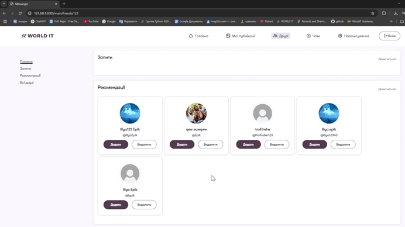
**Viewing a friend's page:** 
In a special section, you can view a friend's profile, their posts, statistics, and also write them a message or remove them from the list. You can go to a friend's page with one click on the friend's card.
**Logic file:**
```js
// main_app/static/main_app/friends.js
for (let card of document.querySelectorAll('.friend-card')){
    card.addEventListener("click",(event)=>{
        // If the click is not on the "Confirm" or "Delete" buttons, go to the friend's page
        if (event.target != card.querySelector('.btn-confirm') && event.target != card.querySelector('.btn-delete')){
            window.location.href = card.querySelector('input').value
        }
    })  
}
```
**Gif demo:** 

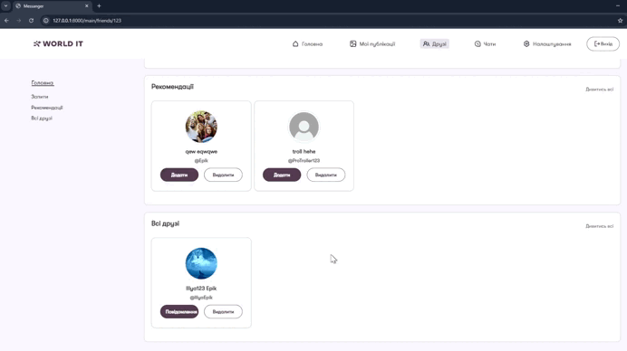

---
## Conclusion

[⇧ Return to navigation](#navigation)

The messenger we created is a modern web application that combines the classic functionality of social platforms with the capabilities of the latest web technologies. Using Django, JavaScript, WebSocket, and modern frontend approaches, the project demonstrates how to implement a full-fledged multi-user service for communication, content exchange, and creation of groups, posts, and albums.

A feature of this messenger is real-time integration via WebSocket, which allows users to receive messages instantly, without reloading the page. This makes communication as convenient as possible and close to the experience of using professional messengers. It is worth noting the implementation of a flexible system of posts, tags, albums, as well as the ability to manage a profile, which makes the application universal for different categories of users.

The project was a great example of teamwork, where each participant was able to show their strengths: from backend architecture and server-side configuration to high-quality layout and integration of modern libraries. We gained valuable experience in planning, task distribution, testing, working with git, and documentation.

Messenger proves that even a small team can create a complex, multi-functional product using open technologies and modern development approaches. This project is not only a learning case, but also a real-life example of how to organize effective interaction between users, ensure security, scalability, and user-friendliness of the interface.

Thanks to this experience, we became confident in our own abilities, learned to solve non-trivial tasks and implement modern solutions in web development. Messenger became for us not just another job, but a real achievement that demonstrates our skills, ability to work in a team and desire to develop in the IT field.