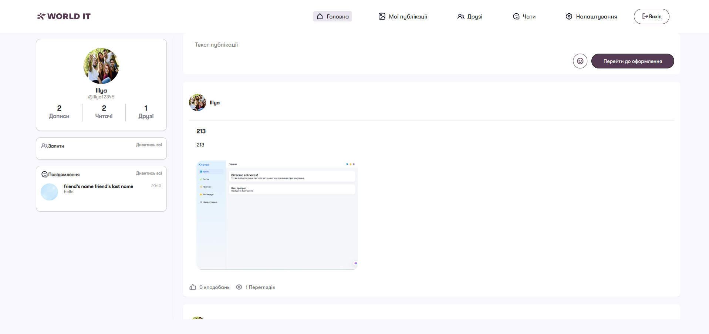
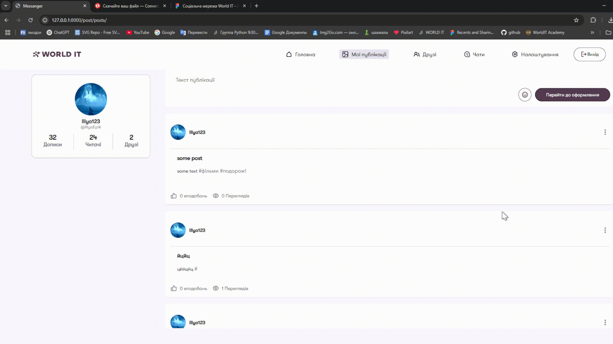
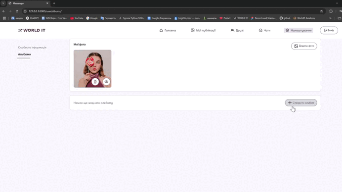
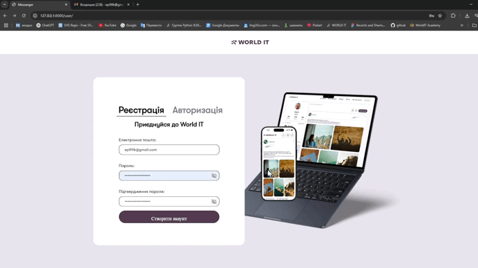
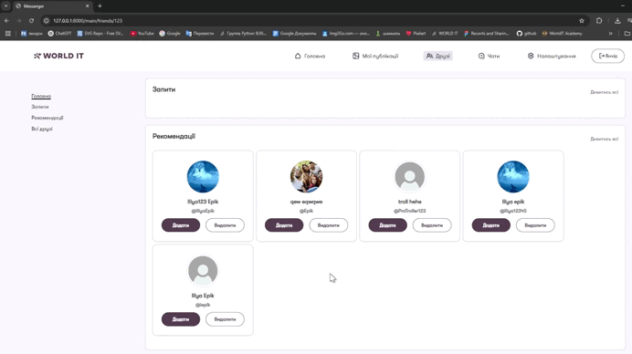
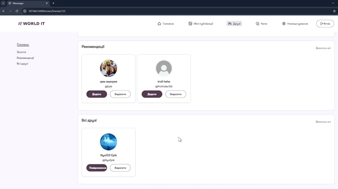

# Месенджер


## Блок пояснення з якою метою створювався проєкт та кому буде він корисним
- Даний проєкт створювався як сучасний веб-месенджер для обміну повідомленнями, створення постів, альбомів та групових чатів.
- Мета — надати користувачам зручний інструмент для спілкування, обміну ідеями, фотографіями та організації спільнот.
- Проєкт буде корисний студентам, викладачам, колективам, друзям, а також всім, хто шукає простий спосіб комунікації та обміну контентом у закритих чи відкритих групах.

---

## Навігація
- [Учасники](#учасники)
- [Інструкція для запуску](#інструкція-для-запуску)
  - [Інструкція для запуску на локальному хості](#інструкція-для-запуску-на-локальному-хості)
  - [Інструкція для запуску на railway](#інструкція-для-запуску-на-railway)
- [Що використовувалось для створення проєкту](#що-використовувалось-для-створення-проєкту)
- [Структура проєкту](#структура-проєкту)
  - [Структура user_app](#структура-user_app)
  - [Структура post_app](#структура-post_app)
  - [Структура chat_app](#структура-chat_app)
  - [Структура main_app](#структура-main_app)
  - [Структура messenger_dir](#структура-messenger_dir)
- [Особливості проєкту](#особливості-проєкту)
  - [Малювання електронного підпису](#малювання-електронного-підпису)
  - [Автоматичний перехід між полями вводу коду підтвердження](#автоматичний-перехід-між-полями-вводу-коду-підтвердження)
  - [Зміна аватара користувача](#зміна-аватара-користувача)
  - [Редагування інформації користувача](#редагування-інформації-користувача)
  - [Додавання стандартних тегів до постів](#додавання-стандартних-тегів-до-постів)
  - [Видалення постів](#видалення-постів)
  - [Редагування постів](#редагування-постів)
  - [Додавання постів](#додавання-постів)
  - [Відображення статистики користувача](#відображення-статистики-користувача)
  - [Сторінка друзів](#сторінка-друзів)
  - [Відкриття чату з користувачем](#відкриття-чату-з-користувачем)

---

## Учасники

- **Ілля Епік** — [GitHub](https://github.com/IllyaEpik/messenger)  
  Тимлід проєкту: організація командної роботи, розробка архітектури, інтеграція всіх компонентів, контроль якості, фінальне тестування.

- **Ренат Белей** — [GitHub](https://github.com/Renat19Belei/messenger)  
  Відповідальний за верстку: адаптація дизайну під застосунок, стилізація сторінок, забезпечення зручності користування, впровадження інтерактивних елементів на фронтенді, робота з оформленням.

- **Марк Попович** — [GitHub](https://github.com/markpopovich9/messenger)  
  Розробник бекенду: реалізація серверної логіки, налаштування Django, робота з базою даних, впровадження WebSocket для обміну повідомленнями, забезпечення безпеки та стабільності сервісу.

---

## Інструкція для запуску
### Інструкція для запуску на локальному хості (через термінал)

1. Переконайтесь, що у вас встановлений Python (рекомендовано версію 3.8+).
2. Завантажте проєкт з Github (через кнопку Code → Download ZIP або через git clone).

3. Розархівуйте проєкт у потрібну папку (якщо завантажували ZIP).
4. Відкрийте термінал (cmd, PowerShell або Terminal).
5. Перейдіть у папку з проєктом командою:
   ```
   cd шлях_до_папки_з_проєктом
   ```
6. (Рекомендовано) Створіть та активуйте віртуальне середовище:
   - Windows:
     ```
     python -m venv venv
     venv\Scripts\activate
     ```
   - Mac/Linux:
     ```
     python3 -m venv venv
     source venv/bin/activate
     ```
7. Встановіть залежності:
   ```
   pip install -r requirements.txt
   ```
   (або `pip3 install -r requirements.txt` для Mac/Linux)
8. Виконайте міграції бази даних:
   ```
   python manage.py migrate
   ```
9. Запустіть сервер:
   ```
   python manage.py runserver
   ```
10. Відкрийте браузер і перейдіть за адресою [http://127.0.0.1:8000/](http://127.0.0.1:8000/)

---

### Інструкція для запуску на локальному хості (через PyCharm або VSCode)

1. Відкрийте папку з проєктом у PyCharm або VSCode.
2. Переконайтесь, що у вас встановлений Python (рекомендовано версію 3.8+).
3. (Рекомендовано) Створіть віртуальне середовище через інтерфейс IDE або термінал.
4. Встановіть залежності:
   ```
   pip install -r requirements.txt
   ```
5. Виконайте міграції бази даних:
   ```
   python manage.py migrate
   ```
6. Запустіть сервер через IDE (Run/Debug) або командою:
   ```
   python manage.py runserver
   ```
7. Відкрийте браузер і перейдіть за адресою [http://127.0.0.1:8000/](http://127.0.0.1:8000/)

---

<!-- DJANGO_SETTINGS_MODULE
messenger.settings -->
## Що використовувалось для створення проєкту
+ python
+ javascript
+ html & css
+ django (фреймворк)
+ mysql (база даних)
+ qrcode (модуль)
+ jquery (доповнення до javascript)
+ асинхронність
+ channels (модуль python)
+ daphne (модуль python)

## Структура проєкту

```mermaid
graph TD

    Root{{messenger}}
    Root --> manage[manage.py]
    Root --> requirements[requirements.txt]
    Root --> db[db.mysql]
    Root --> media[media/]
    Root --> messenger_dir[messenger/]
    Root --> chat_app[chat_app/]
    Root --> main_app[main_app/]
    Root --> post_app[post_app/]
    Root --> user_app[user_app/]
``` 

- [Структура user_app](#структура-user_app)
- [Структура post_app](#структура-post_app)
- [Структура chat_app](#структура-chat_app)
- [Структура main_app](#структура-main_app)
- [Структура messenger_dir](#структура-messenger_dir)

---

### Структура user_app
> Описує структуру додатку для управління користувачами: реєстрація, авторизація, профіль, шаблони, статика.

```mermaid
graph TD

    user_app{{user_app/}}
    user_app --> models[models.py]
    user_app --> views[views.py]
    user_app --> urls[urls.py]
    user_app --> forms[forms.py]
    user_app --> templates_user[templates/user_app/]
    templates_user --> profile[profile.html]
    templates_user --> login[login.html]
    templates_user --> register[register.html]
    user_app --> static_user[static/user_app/]
    static_user --> css[css/]
    css --> styl[style.css]
    static_user --> js[js/]
    js --> main[main.js]
    static_user --> images[images/]
```

user_app — додаток для управління користувачами: реєстрація, авторизація.

---

### Структура post_app
> Описує структуру додатку для роботи з постами: створення, перегляд, редагування, видалення постів.

```mermaid
graph TD

    post_app{{post_app/}}
    post_app --> models[models.py]
    post_app --> views[views.py]
    post_app --> urls[urls.py]
    post_app --> forms[forms.py]
    post_app --> templates_post[templates/post_app/]
    templates_post --> post_list[post_list.html]
    templates_post --> post_detail[post_detail.html]
    templates_post --> post_create[post_create.html]
    post_app --> static_post[static/post_app/]
    static_post --> css[css/]
    css --> main_css[main.css]
    static_post --> js[js/]
    js --> main_js[main.js]
    static_post --> images[images/]
```

post_app — додаток для управління постами: створення, перегляд, редагування, видалення постів.

---

### Структура chat_app
> Описує структуру додатку для чатів: групові чати, особисті повідомлення, шаблони, статика.

```mermaid
graph TD

    chat_app{{chat_app/}}
    chat_app --> models[models.py]
    chat_app --> views[views.py]
    chat_app --> urls[urls.py]
    chat_app --> forms[forms.py]
    chat_app --> templates_chat[templates/chat_app/]
    templates_chat --> chat_list[chat_list.html]
    templates_chat --> chat_detail[chat_detail.html]
    chat_app --> static_chat[static/chat_app/]
    static_chat --> css[css/]
    css --> main_css[main.css]
    static_chat --> js[js/]
    js --> main_js[main.js]
    static_chat --> images[images/]
```

chat_app — додаток для управління чатами: створення групових чатів, редагування груп, а також особисті повідомлення між користувачами.

---

### Структура main_app
> Описує структуру головного додатку: загальні сторінки, профіль, редагування даних, аватар, зміна пароля.

```mermaid
graph TD

    main_app{{main_app/}}
    main_app --> models[models.py]
    main_app --> views[views.py]
    main_app --> urls[urls.py]
    main_app --> templates_main[templates/main_app/]
    templates_main --> index[index.html]
    templates_main --> about[about.html]
    templates_main --> contact[contact.html]
    main_app --> static_main[static/main_app/]
    static_main --> css[css/]
    css --> main_css[main.css]
    static_main --> js[js/]
    js --> main_js[main.js]
    static_main --> images[images/]
```

main_app — головний додаток, який містить загальні сторінки: головна сторінка, про нас, контактна інформація, профіль користувача, редагування даних, аватар, зміна пароля тощо.

---

### Структура messenger_dir
> Описує структуру основної конфігурації Django-проєкту: налаштування, маршрутизація, запуск серверу.

```mermaid
graph TD

    messenger_dir{{messenger/}}
    messenger_dir --> settings[settings.py]
    messenger_dir --> urls[urls.py]
    messenger_dir --> asgi[asgi.py]
    messenger_dir --> wsgi[wsgi.py]
```

messenger_dir — основна конфігурація Django-проєкту: налаштування, маршрутизація, запуск серверу.

---

## Особливості проєкту


### Робота з зображеннями

У нашому месенджері реалізовано повноцінну підтримку роботи з зображеннями: користувачі можуть змінювати аватар, додавати фото до постів, створювати альбоми. Завантаження зображень відбувається через форми з попереднім переглядом (preview), а всі файли зберігаються у спеціальній директорії media. Для зручності користувача одразу після вибору файлу відображається його мініатюра. Оновлення аватара чи додавання фото до посту не потребує перезавантаження сторінки — все працює через AJAX.

**Файл з логікою:**
`user_app/static/user_app/personal.js`

**Гіф-демонстрація:**  


---

### Робота з веб-сокетами

Для забезпечення миттєвого обміну повідомленнями у чатах використовується WebSocket. Кожен чат (груповий чи особистий) має власний канал, і всі повідомлення передаються у реальному часі без перезавантаження сторінки. Коли користувач відкриває чат, на клієнті створюється WebSocket-з'єднання з сервером, і всі нові повідомлення одразу з'являються у вікні чату.

**Файл з логікою:**  
`chat_app/consumers.py`  
`chat_app/static/chat_app/chat.js`  
**Гіф-демонстрація:**  


---

### Принцип роботи постів

Користувачі можуть створювати, редагувати та видаляти пости, додавати до них зображення та теги. Всі дії з постами виконуються через AJAX, що забезпечує швидку взаємодію без перезавантаження сторінки. Пости зберігаються у базі даних, а зображення — у директорії media. Для кожного поста можна додати кілька зображень, а також використовувати стандартні або власні теги для зручної навігації.

**Файл з логікою:**  
`post_app/views.py`, `post_app/forms.py`
**Гіф-демонстрація:**  


---

### Принцип роботи альбомів

**Створення альбому:**  
Користувач може створити новий альбом, вказавши його назву та опис. Після створення альбому можна додавати до нього фотографії. Всі дії виконуються через асинхронні запити, що дозволяє одразу бачити результат без перезавантаження сторінки.
```python
# user_app/views.py
form_type = request.POST.get("type")
if form_type == 'album':
    # Створення нового альбому
    theme=request.POST.get("themeSelect")
    tag=Tag.objects.filter(name=theme).first()
    if not tag:
        tag = Tag.objects.create(name=theme)
    album = Album.objects.create(
        name = request.POST.get("name"),
        topic= tag,
        author=profile
    )
    album.created_at = album.created_at.replace(year=int(request.POST.get("year")))
    album.save()
```
**Додавання та перегляд зображень:**  
До кожного альбому можна додати декілька зображень. Всі фото відображаються у зручному інтерфейсі, де можна переглядати їх у повному розмірі, видаляти або додавати нові. Завантаження зображень відбувається через форми з попереднім переглядом.
```python
# user_app/views.py
elif form_type == 'images':
# Додавання зображень до альбому
album = Album.objects.get(pk=int(request.POST.get("pk")))
img_list = []
for img in request.FILES.getlist('images'):
    album.images.add(Image.objects.create(file=img))
    album.save()
album.save()
```
**Файл з логікою:**  
`user_app/views.py`, `user_app/static/user_app/albums.js`  
**Гіф-демонстрація:**  


---

### Принцип роботи чатів

**Відкриття чату:**  
Користувач може відкрити як особистий, так і груповий чат. При відкритті чату встановлюється WebSocket-з'єднання з сервером, і всі нові повідомлення надходять у реальному часі. Інтерфейс чату оновлюється миттєво для всіх учасників.

**Відправка повідомлень:**  
Повідомлення (текстові та зображення) надсилаються через WebSocket, що забезпечує їх миттєву доставку всім учасникам чату. Для групових чатів реалізовано додавання/видалення учасників, зміну аватара та назви групи.

**Файл з логікою:**  
`chat_app/views.py`, `chat_app/static/chat_app/chat.js`  
**Гіф-демонстрація:**  


---

### Робота з AJAX

Більшість дій у застосунку (додавання/редагування постів, зміна аватара, редагування профілю, додавання друзів) виконуються асинхронно через AJAX. Це дозволяє оновлювати лише необхідні частини сторінки, не перезавантажуючи всю сторінку, що значно покращує користувацький досвід.

**Файл з логікою:**  
`user_app/static/user_app/personal.js`  
**Гіф-демонстрація:**  


---

### Принцип роботи реєстрації та авторизації

Реєстрація та авторизація реалізовані через стандартні Django-форми з додатковими перевірками. Після реєстрації користувач отримує листа для підтвердження email (якщо налаштовано), а при вході — проходить перевірку даних. Для безпеки використовується CSRF-захист, а всі паролі зберігаються у хешованому вигляді.

**Файл з логікою:**  
`user_app/views.py`
**Гіф-демонстрація:**  


---

### Принцип роботи додатку друзів та додавання нових користувачів до свого списку друзів

**Додавання та підтвердження друзів:**  
Користувачі можуть надсилати запити на додавання у друзі, підтверджувати чи відхиляти їх. Всі дії виконуються асинхронно, що забезпечує швидку реакцію інтерфейсу. Після підтвердження користувачі з'являються у списку друзів.
**Файл з логікою:**  
`main_app/views.py`, `main_app/static/main_app/friends.js`  
**Гіф-демонстрація:**  

**Перегляд сторінки друга:**  
У спеціальному розділі можна переглянути профіль друга, його пости, статистику, а також написати йому повідомлення або видалити зі списку. Перехід на сторінку друга здійснюється одним кліком по картці друга.
**Файл з логікою:**  
`main_app/views.py`, `main_app/static/main_app/friends.js`
**Гіф-демонстрація:**  



---
## Висновок

Месенджер, який ми створили, є сучасним веб-застосунком, що поєднує класичний функціонал соціальних платформ із можливостями новітніх веб-технологій. Завдяки використанню Django, JavaScript, WebSocket та сучасних підходів до фронтенду, проєкт демонструє, як можна реалізувати повноцінний багатокористувацький сервіс для спілкування, обміну контентом, створення груп, постів та альбомів.

Особливістю цього месенджера є інтеграція реального часу через WebSocket, що дозволяє користувачам отримувати повідомлення миттєво, без перезавантаження сторінки. Це робить спілкування максимально зручним і наближеним до досвіду використання професійних месенджерів. Окремо варто відзначити реалізацію гнучкої системи постів, тегів, альбомів, а також можливість керування профілем, що робить застосунок універсальним для різних категорій користувачів.

Проєкт став чудовим прикладом командної роботи, де кожен учасник зміг проявити свої сильні сторони: від архітектури бекенду та налаштування серверної частини до якісної верстки, і інтеграції сучасних бібліотек. Ми отримали цінний досвід у плануванні, розподілі задач, тестуванні, роботі з git та документацією.

Месенджер підтверджує, що навіть невелика команда може створити складний, багатофункціональний продукт, використовуючи відкриті технології та сучасні підходи до розробки. Цей проєкт — не лише навчальний кейс, а й реальний приклад того, як можна організувати ефективну взаємодію між користувачами, забезпечити безпеку, масштабованість і зручність інтерфейсу.

Завдяки цьому досвіду ми переконалися у власних силах, навчилися вирішувати нетривіальні завдання та впроваджувати сучасні рішення у веб-розробці. Месенджер став для нас не просто черговою роботою, а справжнім досягненням, яке демонструє наші навички, вміння працювати в команді та бажання розвиватися у сфері IT.