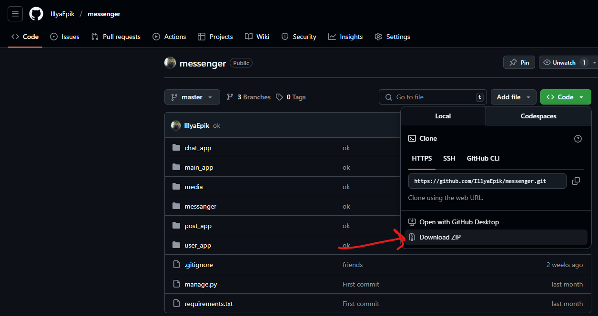
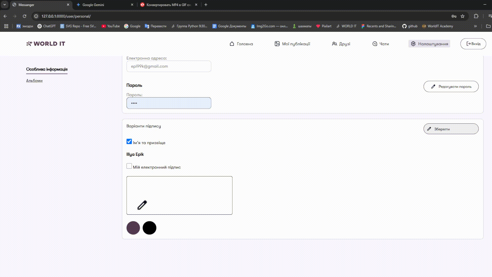
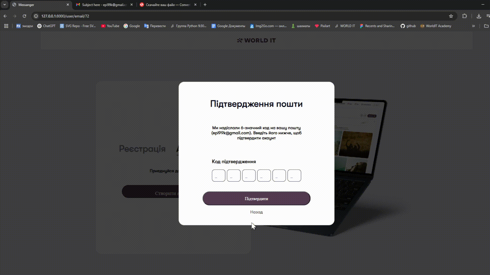
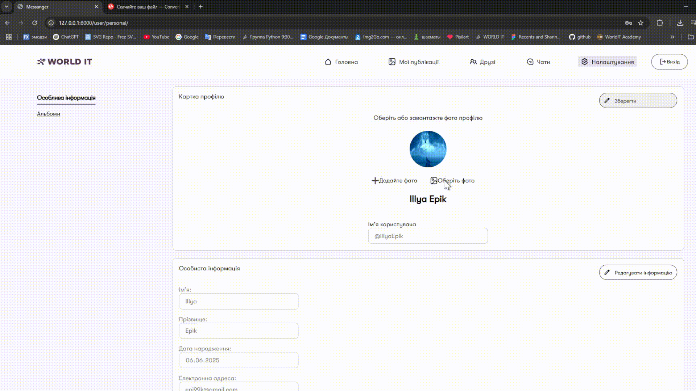
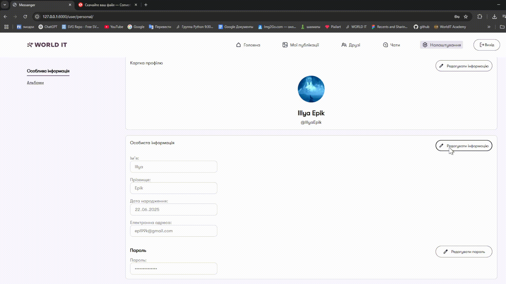
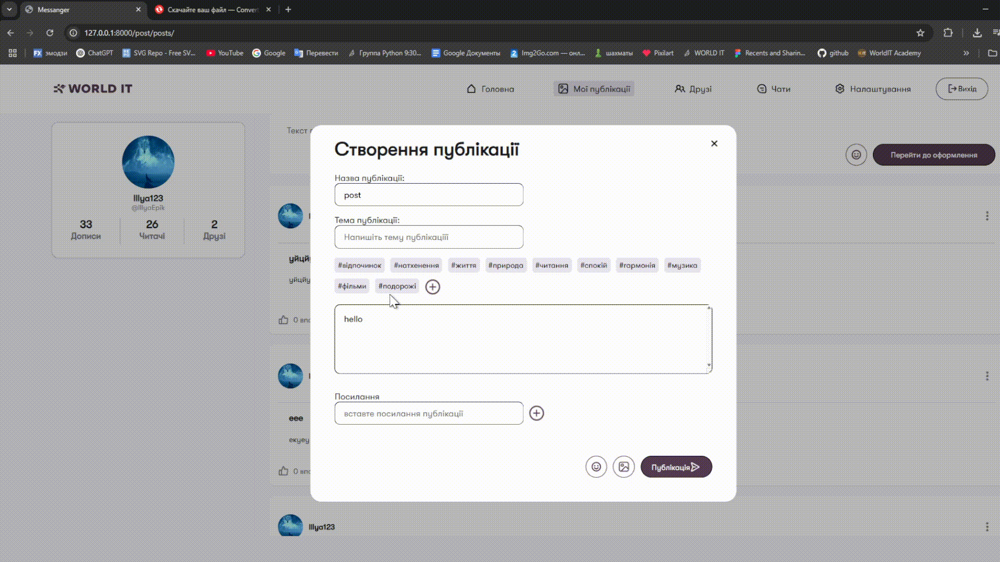
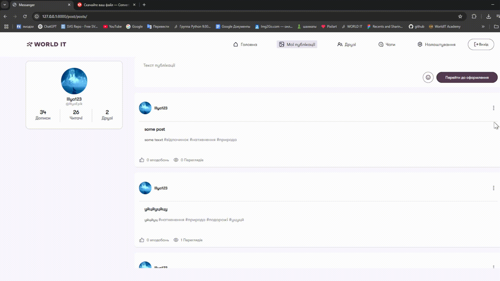
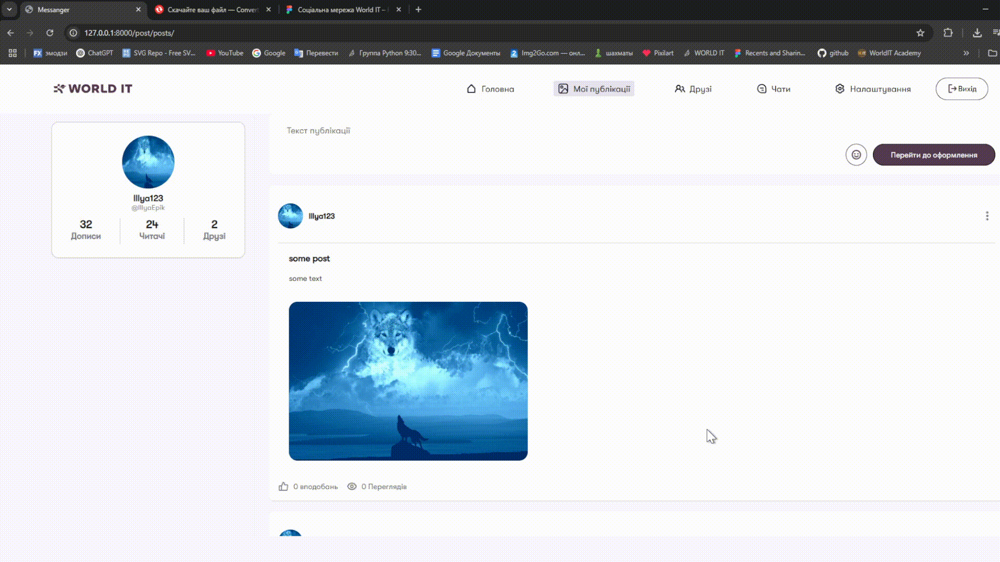
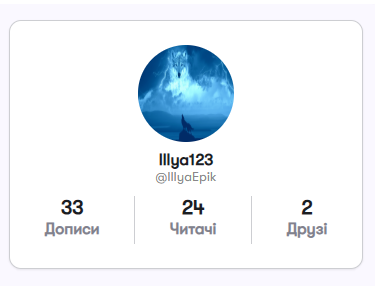

# Назва проекту Месенджер

## Опис
- Цей проєкт дозволяє обмінюватись повідомленнями, створювати пости, створювати альбоми
- Реалізовано можливість створення групових чатів, де користувачі можуть спілкуватись між собою
- Реалізовано можливість створення постів, де користувачі можуть ділитись своїми думками, ідеями та фотографіями
- Реалізовано можливість створення альбомів, де користувачі можуть зберігати свої фотографії та ділитись ними з іншими користувачами
- Реалізовано можливість реєстрації та авторизації користувачів

---

## Навігація
- [учасники](#учасники)
- [інструкція для запуску](#інструкція-для-запуску)
  - [інструкція для запуску на локальному хості](#інструкція-для-запуску-на-локальному-хості)
  - [інструкція для запуску на railway](#інструкція-для-запуску-на-railway)
- [що використовувалось для створення проєкту](#що-використовувалось-для-створення-проєкту)
- [структура проєкту](#структура-проєкту)
  - [структура user_app](#структура-user_app)
  - [структура post_app](#структура-post_app)
  - [структура chat_app](#структура-chat_app)
  - [структура main_app](#структура-main_app)
  - [структура messenger_dir](#структура-messenger_dir)
- [особливості проєкту](#особливості-проєкту)
  - [малювання електронного підпису](#малювання-електронного-підпису)
  - [автоматичний перехід між полями вводу коду підтвердження](#автоматичний-перехід-між-полями-вводу-коду-підтвердження)
  - [зміна аватара користувача](#зміна-аватара-користувача)
  - [редагування інформації користувача](#редагування-інформації-користувача)
  - [додавання стандартних тегів до постів](#додавання-стандартних-тегів-до-постів)
  - [видалення постів](#видалення-постів)
  - [редагування постів](#редагування-постів)
  - [додавання постів](#додавання-постів)
  - [відображення статистики користувача](#відображення-статистики-користувача)
  - [сторінка друзів](#сторінка-друзів)
  - [відкриття чату з користувачем](#відкриття-чату-з-користувачем)

---

## Учасники
- [Ілля Епік / Illia Epik](https://github.com/IllyaEpik/messenger)
- [Марк Попович / Mark Popovich](https://github.com/markpopovich9/messenger)
- [Ренат Белей / Renat Belei](https://github.com/Renat19Belei/messenger.git)
--- 
---
## Інструкція для запуску
### Інструкція для запуску на локальному хості
+ Впевнись що у тебе завантажено python
+ Завантажити проєкт з Github

+ Розархівувати проєкт у потрібну папку
+ Відкривай cmd чи термінал
+ У терміналі переходь у потрібну папку
+ Вписуй команду у терміналі: <code onclick="navigator.clipboard.writeText('pip install -r requirements.txt')">pip install -r requirements.txt</code> якщо у вас mac os то pip3 
+ Вписуй наступну команду у терміналі: <code onclick="navigator.clipboard.writeText('python manage.py runserver')">python manage.py runserver</code>
+ Все проєкт запущений `http://127.0.0.1:8000/`
---
### Інструкція для запуску на railway
+ Переконайтесь що у вас є github акаунт
+ Зробіть fork на github

+ Після того як ви зробили fork перейдіть на це [посилання](https://railway.com/)
+ Виберіть репозиторій у якому ви зробили fork

---

<!-- DJANGO_SETTINGS_MODULE
messenger.settings -->
## Що використовувалось для створення проєкту
+ python
+ javascript
+ html & css
+ django (фреймворк)
+ mysql (база даних)
+ qrcode (модуль)
+ jquery (доповнення до javascript)
+ асинхронність
+ channels (модуль python)
+ daphne (модуль python)

## Структура проєкту

```mermaid
graph TD

    Root{{messenger}}
    Root --> manage[manage.py]
    Root --> requirements[requirements.txt]
    Root --> db[db.mysql]
    Root --> media[media/]
    Root --> messenger_dir[messenger/]
    Root --> chat_app[chat_app/]
    Root --> main_app[main_app/]
    Root --> post_app[post_app/]
    Root --> user_app[user_app/]
``` 

- [Структура user_app](#структура-user_app)
- [Структура post_app](#структура-post_app)
- [Структура chat_app](#структура-chat_app)
- [Структура main_app](#структура-main_app)
- [Структура messenger_dir](#структура-messenger_dir)

---

### Структура user_app
> Описує структуру додатку для управління користувачами: реєстрація, авторизація, профіль, шаблони, статика.

```mermaid
graph TD

    user_app{{user_app/}}
    user_app --> models[models.py]
    user_app --> views[views.py]
    user_app --> urls[urls.py]
    user_app --> forms[forms.py]
    user_app --> templates_user[templates/user_app/]
    templates_user --> profile[profile.html]
    templates_user --> login[login.html]
    templates_user --> register[register.html]
    user_app --> static_user[static/user_app/]
    static_user --> css[css/]
    css --> styl[style.css]
    static_user --> js[js/]
    js --> main[main.js]
    static_user --> images[images/]
```

user_app — додаток для управління користувачами: реєстрація, авторизація.

---

### Структура post_app
> Описує структуру додатку для роботи з постами: створення, перегляд, редагування, видалення постів.

```mermaid
graph TD

    post_app{{post_app/}}
    post_app --> models[models.py]
    post_app --> views[views.py]
    post_app --> urls[urls.py]
    post_app --> forms[forms.py]
    post_app --> templates_post[templates/post_app/]
    templates_post --> post_list[post_list.html]
    templates_post --> post_detail[post_detail.html]
    templates_post --> post_create[post_create.html]
    post_app --> static_post[static/post_app/]
    static_post --> css[css/]
    css --> main_css[main.css]
    static_post --> js[js/]
    js --> main_js[main.js]
    static_post --> images[images/]
```

post_app — додаток для управління постами: створення, перегляд, редагування, видалення постів.

---

### Структура chat_app
> Описує структуру додатку для чатів: групові чати, особисті повідомлення, шаблони, статика.

```mermaid
graph TD

    chat_app{{chat_app/}}
    chat_app --> models[models.py]
    chat_app --> views[views.py]
    chat_app --> urls[urls.py]
    chat_app --> forms[forms.py]
    chat_app --> templates_chat[templates/chat_app/]
    templates_chat --> chat_list[chat_list.html]
    templates_chat --> chat_detail[chat_detail.html]
    chat_app --> static_chat[static/chat_app/]
    static_chat --> css[css/]
    css --> main_css[main.css]
    static_chat --> js[js/]
    js --> main_js[main.js]
    static_chat --> images[images/]
```

chat_app — додаток для управління чатами: створення групових чатів, редагування груп, а також особисті повідомлення між користувачами.

---

### Структура main_app
> Описує структуру головного додатку: загальні сторінки, профіль, редагування даних, аватар, зміна пароля.

```mermaid
graph TD

    main_app{{main_app/}}
    main_app --> models[models.py]
    main_app --> views[views.py]
    main_app --> urls[urls.py]
    main_app --> templates_main[templates/main_app/]
    templates_main --> index[index.html]
    templates_main --> about[about.html]
    templates_main --> contact[contact.html]
    main_app --> static_main[static/main_app/]
    static_main --> css[css/]
    css --> main_css[main.css]
    static_main --> js[js/]
    js --> main_js[main.js]
    static_main --> images[images/]
```

main_app — головний додаток, який містить загальні сторінки: головна сторінка, про нас, контактна інформація, профіль користувача, редагування даних, аватар, зміна пароля тощо.

---

### Структура messenger_dir
> Описує структуру основної конфігурації Django-проєкту: налаштування, маршрутизація, запуск серверу.

```mermaid
graph TD

    messenger_dir{{messenger/}}
    messenger_dir --> settings[settings.py]
    messenger_dir --> urls[urls.py]
    messenger_dir --> asgi[asgi.py]
    messenger_dir --> wsgi[wsgi.py]
```

messenger_dir — основна конфігурація Django-проєкту: налаштування, маршрутизація, запуск серверу.

---

## Особливості проєкту

---

### Малювання електронного підпису
> Дозволяє малювати електронний підпис прямо на canvas.

```js
// Цей код дозволяє малювати на canvas для створення електронного підпису.
let canvas = document.querySelector('canvas')
canvas.style.padding = 0
let draw = canvas.getContext('2d')
draw.fillStyle = 'black'
draw.fillStyle = 'blue'
let drawing = false

function coor(event){
    let rect = canvas.getBoundingClientRect()
    return [(event.clientX-rect.left+0.1)*canvas.width / rect.width,(event.clientY-rect.top+7)*canvas.height / rect.height]
}
canvas.addEventListener('mousedown', (event) => {
    pastplace = coor(event)
    drawing = true
})
document.addEventListener('mouseup',()=> {
    drawing = false
})
let pastplace = []
canvas.addEventListener('mousemove',(event)=>{
    if (drawing){
        draw.beginPath();
        draw.moveTo(pastplace[0], pastplace[1]);
        pastplace = coor(event)
        draw.lineTo(pastplace[0], pastplace[1]);
        draw.stroke();
    }
})
```


---

### Автоматичний перехід між полями вводу коду підтвердження
> Автоматично переміщує фокус між полями при введенні коду підтвердження.

```js
// Получаем все инпуты для ввода кода подтверждения
const inputs = document.querySelectorAll('.code');
// Форма подтверждения email
const form = document.querySelector('.email');

// Ставим фокус на первый инпут
inputs[0].focus()

// Обработка ввода с клавиатуры для автоматического перехода между полями
document.addEventListener('keyup',function(event) {
    if (document.activeElement != document.body){
        // Получаем номер текущего поля
        let number =document.activeElement.name[document.activeElement.name.length-1]
        if (event.key=='Backspace'){
            // При удалении переходим к предыдущему полю
            if (1<number){
                inputs[number-2].focus()
            }
        }else{
            // Если поле заполнено, переходим к следующему или отправляем форму
            if (document.activeElement.value) {
                if (number != 6) {
                    inputs[number].focus()
                }else{
                    form.submit()
                }
            }
        }
    }
})
```


---

### Зміна аватара користувача
> Дозволяє змінювати аватар користувача з миттєвим відображенням нового зображення.

```js
// Получаем элементы: картинку смены аватарки и input для выбора файла
let avatar = document.querySelector('#avatar')
let fileInput = document.getElementById('fileInput')
// Создаем FileReader для чтения выбранного изображения
const reader = new FileReader()
// После выбора файла сразу отображаем превью аватарки на всех элементах с классом .avatar
reader.onload = (loadEvent) => {
    let avatars = document.querySelectorAll('.avatar')
    for (let avatar of avatars){
        avatar.src = loadEvent.target.result
    }
}
// При изменении файла (выбор нового изображения) запускаем чтение файла и обновление превью
fileInput.addEventListener('change',()=>{
    reader.readAsDataURL(fileInput.files[0])
})
```


---

### Редагування інформації користувача
> Дозволяє редагувати особисту інформацію користувача через AJAX.

```js
// Получаем кнопку "Редагувати інформацію" и иконку редактирования
let info = document.querySelector('#info')
let editImg = document.querySelector('.edit-img')

// Обработчик клика по кнопке редактирования информации
info.addEventListener('click',()=>{
    let info = document.querySelector('#info')
    let inputs = document.querySelectorAll('.FormInput') 
    // Если уже активен режим редактирования — выключаем его и отправляем изменения на сервер
    if (info.classList.contains('active')){
        info.classList.remove('active')
        for (let input of inputs){
            input.requered = false
            input.readOnly = true
            input.classList.add('gray-input')
        }
        // Получаем значения из полей формы
        let first_name = document.querySelector('[name="first_name"]').value
        let last_name = document.querySelector('[name="last_name"]').value
        // Отправляем изменения на сервер через AJAX
        $.ajax({
            type: 'post',
            url: document.querySelector('#personalUrl').value,
            data: {
                csrfmiddlewaretoken:document.querySelector('input').value,
                first_name: first_name,
                last_name: last_name,
                email: document.querySelector('[name="email"]').value,
                date_of_birthday: document.querySelector('[name="date_of_birthday"]').value,
                type:'main_data' // вказуємо, що потрібно редагувати в нашому випадку основні дані
            },
            success:function(request){
                // Обновляем имя пользователя на странице
                let name_tags = document.querySelectorAll('.name-h2, h4')
                for(let tag of name_tags){
                    tag.textContent = `${first_name} ${last_name}`
                }
            }
        })
        info.textContent = ''
        info.append(editImg)
        info.innerHTML += `Редагувати інформацію`
    }else{
        // Включаем режим редактирования: делаем поля активными
        info.classList.add('active')
        for (let input of inputs){
            if (!input.classList.contains('password')){
                input.requered = true
                input.readOnly = false
                input.classList.remove('gray-input')
            }
        }
        info.textContent = ''
        info.append(editImg)
        info.innerHTML += `Зберегти`
    }
})
```


---

### Додавання стандартних тегів до постів
> Додає стандартні теги до постів натисканням на них.

```js
let objectOfStandard_tags = {}

// Получаем все элементы стандартных тегов
let standard_tags = document.querySelectorAll('.standard_tag')
// Для каждого стандартного тега добавляем обработчик клика
for (let standard_tag of standard_tags){
    standard_tag.addEventListener('click',()=>{
        // Если тег еще не был добавлен, добавляем его в объект и на страницу
        if (!(standard_tag.value in objectOfStandard_tags)){
            objectOfStandard_tags[standard_tag.value] = 1
            // Создаем span для отображения тега
            let sp = document.createElement('span')
            // Создаем скрытый input для передачи значения на сервер
            let inp = document.createElement('input')
            inp.type = 'hidden'
            inp.value = standard_tag.value
            inp.name = 'everyTag'
            sp.className = 'everyTag'
            sp.textContent = standard_tag.value + ' '
            // Добавляем тег и скрытый input в контейнер
            input.append(sp)
            input.append(inp)
        }
    })
}
```
```python
# Список стандартных тегов для постов
standard_tags_list = '#відпочинок #натхенення #життя #природа #читання #спокій #гармонія #музика #фільми #подорожі'.split(' ')

# Включаемый тег для отображения стандартных тегов (создает их, если не существуют)
@register.inclusion_tag(filename = "post_app/inclusiontags/standard_tags.html")
def standard_tags():
    tags = []
    for standard_tag in standard_tags_list:
        tag = Tag.objects.filter(name = standard_tag).first()
        if tag == None:
            tags.append( Tag.objects.create(name = standard_tag))
        else:
            tags += [tag]
    return {'tags':tags}
```




---


### Видалення постів
> Дозволяє видаляти свої пости через AJAX-запит і видалення з DOM.

```js
// js post_app/script.js
// Получаем все кнопки удаления постов
let removes =document.querySelectorAll(".remove")
// Для каждой кнопки удаления добавляем обработчик клика
for (let remove of removes){
    // Формируем ссылку для удаления, подставляя id поста
    let link1 = removeLink.value.split('1').join(remove.id)
    remove.addEventListener('click', () => {
        // Отправляем AJAX-запрос на удаление поста
        $.ajax({
            type: 'post',
            url: link1,
            data: {csrfmiddlewaretoken:csrf,posts:JSON.stringify(list)}, 
            success: function(request){}
        })
        // Удаляем пост из DOM после успешного запроса
        document.querySelector('#post'+remove.id).remove()
    })
}
```

```python 
# python post_app/views.py
@login_required(login_url=reverse_lazy('login'))
def remove(request:WSGIRequest,pk:int):
    # Получаем пост по его первичному ключу (id)
    user_post = get_object_or_404(Post, pk=pk)
    # Проверяем, что автор поста совпадает с текущим пользователем
    if user_post.author == Profile.objects.get(user=request.user):
        # Удаляем пост, если пользователь — автор
        Post.delete(user_post)
    # Возвращаем обновленный шаблон с постами (или пустой, если все удалено)
    return render(request, "post_app/new_posts.html")
```



---

### Редагування постів
> Дозволяє редагувати свої пости через модальне вікно з AJAX-завантаженням даних.

```js
// Получаем все кнопки редактирования постов
let edits =document.querySelectorAll(".edit")
// Для каждой кнопки добавляем обработчик клика
for (let edit of edits){
    edit.addEventListener('click', () => {
        // Получаем id поста для редактирования
        let index = edit.id
        // Показываем модальное окно для редактирования поста
        document.querySelector('#bg').classList.remove('hidden')
        document.querySelector('#modalForm').classList.remove('hidden')
        // Устанавливаем тип редактируемого поста
        document.querySelector('#type').value = index
        // Показываем/скрываем дополнительные элементы, связанные с этим постом
        for (let object of document.querySelectorAll(`#heh${index}`)){
            object.classList.toggle("hidden")
        }
        // Формируем ссылку для получения данных поста
        let link2 = removeLink.value.split('1')
        link2 = link2.join(index)
        link2 = link2.split('remove').join('get')
        // Делаем AJAX-запрос для получения данных поста
        $.ajax({
            type: 'get',
            url: link2,
            success: function(request){
                let trashUrl = document.querySelector('#trash').value
                // Заполняем поля формы данными поста
                document.querySelector('.textInput').value = request.text
                document.querySelector('.linkInput').value = request.link[0]
                document.querySelector('.nameInput').value = request.name
                let count = 0
                // Добавляем изображения поста в форму редактирования
                for (let img of request.imgs){
                    let img_tag = document.createElement('img')
                    img_tag.src = img
                    img_tag.classList.add('image')
                    let div = document.createElement("div")
                    div.id = `div${img}`
                    let trashImg = document.createElement("img")
                    trashImg.src = trashUrl
                    trashImg.id = count
                    count++
                    let button = document.createElement("button")
                    button.type = 'button'
                    button.className = 'removeImg'
                    button.append(trashImg)
                    div.classList.add('imagesDiv')
                    div.append(img_tag)
                    div.append(button)
                    let input = document.querySelector('#images2')
                    button.addEventListener('click',() => {
                        div.remove()
                        input.value += `${trashImg.id} `
                    })
                    document.querySelector('#imagesDiv').append(div)
                }
                // Сохраняем pk изображений
                document.querySelector('#imgs').value += JSON.stringify(request.imgs_pk)
                // Добавляем теги поста в форму редактирования
                for (let tag of request.tags){
                    let span =document.createElement("span")
                    span.style.zIndex = -999999999999999
                    let input = document.createElement("input")
                    input.className = "tag"
                    input.value = '#' + tag
                    input.name = 'tags'
                    span.style.left = -13290808213787
                    document.body.append(span)
                    span.id = 'widthMeasurer'
                    span.textContent = input.value
                    input.style.width = `${span.scrollWidth}px`
                    input.addEventListener('input', () => {
                        span.textContent = input.value
                        input.style.width = `${span.scrollWidth}px`
                        if (input.value.split('')[0] != '#'){
                            input.remove()
                        }
                    })
                    document.querySelector(".tags-div").append(input)
                }
            }})
    })
}
```

```python 
@login_required(login_url=reverse_lazy('login'))
def gets(request:WSGIRequest,pk:int):
    # Получаем пост по id
    user_post = Post.objects.get(pk = int(pk))
    # Проверяем, что текущий пользователь — автор поста
    if user_post.author == Profile.objects.get(user=request.user):
        # Собираем данные поста для передачи на фронт
        text = user_post.content
        list_of_imgs = []
        list_of_imgs_pk = []
        for image in user_post.images.all():
            # Добавляем url и pk всех изображений поста
            list_of_imgs += [image.file.url]
            list_of_imgs_pk += [image.pk]
        tags  = []
        for tag in user_post.tags.all():
            tags +=[tag.name]
        links  = []
        for link in Link.objects.filter(post=user_post):
            links.append(link.url)
        # Возвращаем данные поста в формате JSON
        data = JsonResponse({'text':text,'name':user_post.title,"theme":'',"link":links,"imgs":list_of_imgs,"imgs_pk":list_of_imgs_pk,"tags":tags})
        return data
    # Если пользователь не автор поста — возвращаем ошибку
    return JsonResponse({'error':'who are you'})
```



---
### Додавання постів
> Додає нові пости з текстом, зображеннями, тегами та посиланнями.

```python
# python post_app/views.py
class Posts(FormView):
    template_name = "post_app/posts.html"
    form_class = messageForm
    success_url = reverse_lazy('posts')

    # Метод вызывается при успешной валидации формы
    def form_valid(self, form):
        # Получаем список загруженных изображений
        files = self.request.FILES.getlist("images")
        # Получаем список id изображений для удаления (images1)
        remove_List = self.request.POST.get("images1").split(" ")
        del remove_List[-1]
        # Получаем список id изображений для удаления (images2)
        remove_List_2 = self.request.POST.get("images2").split(" ")
        del remove_List_2[-1]
        # Получаем теги (но не используется напрямую)
        self.request.POST.get('tags')
        # Отправляем данные формы на обработку (создание/редактирование поста)
        form.send(
            self.request.user,
            files,
            self.request.POST.get('type'),  # тип запроса (например, создание или редактирование)
            self.request.POST.get('imgs'),
            [remove_List,remove_List_2],
            self.request.POST.getlist('tags') + self.request.POST.getlist('everyTag'),
            self.request.POST.getlist('link'),
        )
        # Продолжаем стандартную обработку формы
        return super().form_valid(form)
```

```python
# python post_app/forms.py
def send(self, user, images, type='save', imgs=[], remove_List=[[],[]], tags=[], links=[]):
    """
    Метод для создания или редактирования поста.

    user: текущий пользователь (автор поста)
    images: список новых загруженных файлов (картинок)
    type: 'save' для создания нового поста, иначе — id редактируемого поста
    imgs: список id уже существующих изображений (pk)
    remove_List: список списков с индексами удаляемых изображений (0 — новые, 1 — существующие)
    tags: список тегов (строки с #)
    links: список ссылок для поста
    """
    if user and user.is_authenticated:
        images_list = []
        tags_list = []
        try:
            count = 0
            for img in json.loads(imgs):
                if not (str(count) in remove_List[1]):
                    images_list += [Image.objects.get(pk=int(img))]
                count+= 1
            
        except Exception as error:
            print(error)
        try:
            count =0
            for image in images:
                if not (str(count) in remove_List[0]):
                    images_list += [Image.objects.create(file=image,filename='lol')]
                count+=1
        except Exception as error:
            print(error)
        text = self.cleaned_data.get('text')
        for tag in tags:
            tag = tag[1::]
            if Tag.objects.filter(name = tag):
                tags_list.append(Tag.objects.filter(name = tag).first())
            else:
                tags_list.append(Tag.objects.create(name= tag))
        if type == 'save':
            
            user_post = Post.objects.create(
                author = Profile.objects.get(user = user),
                title = self.cleaned_data.get('name'),
                content = self.cleaned_data.get('text'),
            )
            user_post.images.set(images_list)
            user_post.tags.set(tags_list)
            user_post.save()
        else:
            
            user_post = Post.objects.get(
                pk=type
            )
            if user_post.author.user == user:
                user_post.content = text
                user_post.title = self.cleaned_data.get('name')
                user_post.images.set(images_list)
                user_post.tags.set(tags_list)
                user_post.save()
        link_list = []
        for link in links:
            link_list += [Link.objects.create(url=link, post = user_post)]
```


---

```html
<!-- html template/post_app/inclusiontags/status.html -->
<div class="stats">
    <div><strong>{{written}}</strong><br><span class="grey">Дописи</span></div>
    <div class="vertical-line"></div>
    <div><strong>{{views}}</strong><br><span class="grey">Читачі</span></div>
    <div class="vertical-line"></div>
    <div><strong>{{friends}}</strong><br><span class="grey">Друзі</span></div>
</div>
```
```python
# python post_app/templatetags/post_tags.py

# Включаемый тег для отображения статистики пользователя (друзья, просмотры, количество постов)
@register.inclusion_tag(filename = "post_app/inclusiontags/status.html")
def status(user):
    profile = Profile.objects.get(user=user)
    # Считаем количество друзей (в обе стороны)
    friends = Friendship.objects.filter(profile1=profile,accepted=True).count()
    friends += Friendship.objects.filter(profile2=profile,accepted=True).count()
    views = 0
    written = 0
    # Считаем количество просмотров и написанных постов
    for post in Post.objects.filter(author=profile):
        views += post.views.count()
        written += 1
    return {
        "user":user,
        'friends':friends,
        'views':views,
        'written':written
    }
```
 

---
### Сторінка друзів
> Дозволяє переглядати, додавати та підтверджувати друзів.

```js
// js main_app/friends.js
// Для каждой карточки друга добавляем обработчик клика
for (let card of document.querySelectorAll('.friend-card')){
    card.addEventListener("click",(event)=>{
        // Если клик не по кнопкам "Подтвердить" или "Удалить", переходим на страницу друга
        if (event.target != card.querySelector('.btn-confirm') && event.target != card.querySelector('.btn-delete')){
            window.location.href = card.querySelector('input').value
        }
    })  
}
```

```python
# python main_app/views.py
def friends_account(request:WSGIRequest,pk):
    # Получаем пользователя по pk профиля
    user_to_view_profile = Profile.objects.get(pk=pk)
    user_to_view = user_to_view_profile.user
    try:
        # Получаем профиль пользователя (если существует)
        user_to_view_profile = Profile.objects.get(user=user_to_view)
    except Profile.DoesNotExist:
        # Если профиль не найден, выводим имя пользователя в консоль
        print(f"'{user_to_view.username}'")

    # Отправляем данные в шаблон для отображения страницы друга
    return render(request, 'main_app/friends_account.html', context={
        'pk': pk,
        'user': user_to_view,
        'profile': user_to_view_profile
    })
```
```html


    <div class="friend-card" id="card{{ user.pk }}">
        <input type="hidden" value="">
        <div class="friend-profile">
            
            <div class="friend-info">
                <strong class="friend-name">{{user.user.first_name }} {{user.user.last_name}}</strong>
                <span class="friend-username">@{{ user.user.username }}</span>
            </div>
        </div>
        <div class="friend-actions">
            <button class="btn btn-confirm" value="{{text}}{{ user.pk }}">{{text}}</button>
            <button class="btn btn-delete">Видалити</button>
        </div>
    </div>

```


---

### Відкриття чату з користувачем
> Дозволяє відкривати чат з користувачем при натисканні на його картку.

```js
function userOpen(users){
for (let user of users){
    user.addEventListener('click',()=>{
        let pk = user.id.split('user').join('')-0
        let icon = user.querySelector('img')
        let name = user.querySelector('.contact-info .contact-name')
        if (!name){
            name = user.querySelector('.groupName')
        }
        name = name.textContent
        document.querySelector('.friend-current-name').textContent = name
        currentIcon.src = icon.src
        groupPk = pk
        document.querySelector('.center-message').hidden = true
        document.querySelector('#haederCard').style.display = 'flex'
        document.querySelector('#chatCard').style.display = 'flex'
        $.ajax({
            type: 'post',
            url: window.location.href,
            data: {

                csrfmiddlewaretoken:document.querySelector('input').value,
                pk: pk,
                type:'personal'},
            success: function(request){
                messages.innerHTML = request
                groupPk = messages.querySelector('#pkInput').value
                messageCreate()
                currectTimes()
            }
        })
        
    })
}}
```

```python
def get(request:WSGIRequest):
    profile = Profile.objects.get(user=request.user)
    chat_group = ChatGroup.objects.filter(pk=int(request.POST.get('pk'))).filter(members=profile).first()
    name = chat_group.name

    members = chat_group.members.all()
    members_list = {}
    for member in members:
        members_list[str(member.pk)] = '312132'
    avatar=None
    if chat_group.avatar:
        avatar=chat_group.avatar.url
    return JsonResponse({
        'name':name,
        'members':members_list,
        'avatar':avatar
    })
```

```html


<!-- Скрытые поля для передачи pk чата и статуса администратора -->
<input type="hidden" value="{{ pk }}" id="pkInput">
<input type="hidden" name="is_admin" value="{{is_admin}}" id="is_admin">
<!-- Перебираем все сообщения в чате -->

    
        <!-- Сообщение пользователя (отправителя) -->
        <p class="my message">
            
                <!-- Если есть прикрепленное изображение, показываем его -->
                
            
            <span class="messageContent">
                <span>{{message.content}}</span>
                <span class="details-message"> 
                    <!-- Время отправки и иконка статуса -->
                    <span class="time messageTime">{{ message.send_at.isoformat }}</span> 
                     
                </span>
            </span> 
        </p>
    
        <!-- Сообщение другого пользователя -->
        <p class="message">
            
            <span class="message-data">
                
                    <!-- Если есть прикрепленное изображение, показываем его -->
                    
                
                <span class="username">
                    {{message.author.first_name}} {{message.author.last_name}}
                </span>
                <span class="messageContent">
                    {{message.content}} 
                    <span class="details-message"> 
                        <!-- Время отправки и иконка статуса -->
                        <span class="time messageTime">{{ message.send_at.isoformat }}</span> 
                         
                    </span>
                </span>
            </span>
        </p>
    

```

